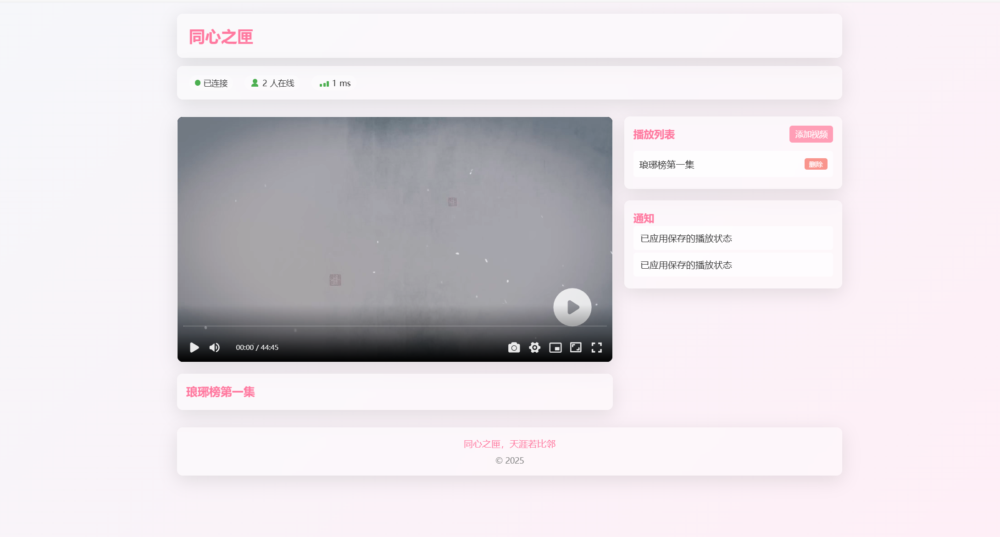

# 同心之匣 - 天涯若比邻

## 项目初衷

异地恋，和老婆一起看视频追剧用的实时同步视频播放网站。

【创作初衷：让星河滚烫处，有我们共享的月光】

凌晨三点的城市像一张未显影的胶片，我盯着屏幕上暂停的爱情电影，光标在"分享"键上徘徊良久。此刻南半球的你应该正沐浴着晨光，我们之间隔着的不仅是十二个时区，还有无数个想要说"快看这里"却错位的瞬间。正是这些细碎的遗憾，让我萌生了创造"同心之匣"的冲动。

在研发的86400秒里，我们研读过上万条异地情侣的私语。有人把手机贴在胸口让恋人听心跳，有人在视频通话里同步拆礼物，更多的深夜总藏着那句"要是此刻能一起看..."的叹息。这些声音最终凝结成我们的核心设计：毫秒级的同步技术让两个画面帧率完美契合，智能预加载系统确保卡顿不会打破情绪流动，虚拟同屏空间里甚至能看见对方触碰进度条时泛起的涟漪。

但技术只是载体，真正重要的是那些藏在代码里的温柔。当你们同时为某个镜头屏住呼吸，当弹幕突然跳出对方手写的"这里让我想起初吻"，当暂停时自动开启的语音通道传来恋人带着笑意的鼻息——那些被距离稀释的日常，就在共享的光影里重新变得鲜活。我们特意保留的"心动感应"功能，会让播放器在检测到双方心率加速时，自动洒落漫天星辰特效，让说不出口的悸动化作可视的银河。

有位内测用户说，跨洋看《爱在黎明破晓前》那天，她和恋人同时按下暂停键的瞬间，窗外的晨昏线恰好掠过两座城市。这种时空交错的浪漫，正是我们向往的"天涯若比邻"。在这个视频网站日均使用时长突破8小时的时代，"同心之匣"不想制造新的沉迷，只愿为那些认真相爱的人，搭建一座让思念具象化的桥梁。

或许某天，当你们在"双人收藏夹"里积攒了99部共同看过的影片，会突然发现：那些需要刻意寻找话题的夜晚，早已被共享的悲欢熨烫得柔软妥帖。距离或许依然丈量着地理坐标，但同步跳动的进度条，正悄然生长为爱情的年轮。

谨以"同心之匣"献给所有相信"所爱隔山海，山海皆可平"的灵魂。愿每个独自观影的深夜，都有千里之外传来的温度；每次按下播放键，都像在说：我在。

## 项目简介

同心之匣是一个基于WebSocket的多人同步视频播放系统，允许多个用户同时观看同一视频，并实时同步播放状态。无论用户身处何地，都能享受到共同观影的乐趣，实现"天涯若比邻"的观影体验。

## 项目截图

- **PC端网页截图**
<details>

<summary>点击展开查看图片</summary>



</details>

- **移动端网页截图**
<details>

<summary>点击展开查看图片</summary>


</details>


## 核心功能

- **实时同步播放**：所有用户的视频播放、暂停、进度跳转都能实时同步
- **视频管理**：添加、删除视频，支持在线视频URL
- **播放状态保存**：自动保存最后的播放位置和状态
- **多设备支持**：适配PC和移动设备，响应式设计
- **连接状态监控**：显示网络延迟和连接状态
- **实时通知系统**：用户加入、离开等事件的实时通知
- **磨砂玻璃UI**：现代化、美观的用户界面

## 技术栈

- **前端**：原生JavaScript、CSS3、ArtPlayer视频播放器
- **后端**：Node.js、Express、WebSocket
- **通信**：WebSocket实时双向通信
- **数据存储**：JSON配置文件

## 系统架构

### 前端

- **播放器组件**：基于ArtPlayer实现，支持各种播放控制
- **视频列表**：显示可播放的视频，支持添加和删除
- **通知区域**：显示系统消息和用户活动
- **状态指示器**：显示连接状态和网络延迟
- **响应式布局**：适配不同屏幕尺寸

### 后端

- **WebSocket服务器**：处理客户端连接和消息传递
- **API接口**：提供视频管理功能
- **状态管理**：维护当前播放状态
- **配置保存**：自动保存系统状态到配置文件

## 使用方法

### 安装

```bash
# 克隆项目
git clone https://github.com/xinxinyihao/tongxinzhixia.git

# 安装依赖
npm install
```

### 运行

```bash
# 启动服务器
npm start
```

服务器启动后，将显示HTTP和WebSocket服务的访问地址。

### 访问

- 在浏览器中打开显示的HTTP地址（如`http://localhost:8833`）
- 多个用户访问同一地址，即可实现同步观影

## 特色功能详解

### 实时同步机制

- 基于WebSocket的实时通信
- 自动处理网络延迟补偿
- 播放状态的定期同步更新

### 自适应连接策略

- 自动检测访问方式（域名/IP）
- 端口模式和路径模式双重支持
- 断线自动重连机制

### 多设备兼容

- 移动设备的特殊处理
- 自动播放限制的解决方案
- 触摸交互优化

### 用户体验优化

- 磨砂玻璃效果的现代UI
- 弹窗通知系统
- 网络状态实时监控

## 配置说明

服务器配置文件`config.json`包含以下配置项：

```json
{
  "server": {
    "port": 8833,
    "enableNotifications": true,
    "autoPlayNext": true,
    "networkDelayThreshold": 600
  },
  "videos": [
    {
      "name": "视频名称",
      "url": "视频URL",
      "id": "唯一ID"
    }
  ],
  "currentVideo": {
    "id": "当前播放视频ID",
    "position": 0,
    "playing": false
  }
}
```

## 系统原理

### 播放同步流程

1. 第一个用户打开页面，自动加载配置文件中的上次播放状态
2. 新用户加入时，接收当前正在播放的实时状态
3. 任何用户的播放操作都通过WebSocket广播给所有其他用户
4. 所有用户离开时，自动保存最后的播放状态

### 状态保存机制

- 定期自动保存（每10分钟）
- 所有用户离开时保存
- 用户手动关闭页面时保存当前播放位置

## 部署指南

### 本地部署

适用于局域网内多设备同步观看。

### 服务器部署

1. 确保服务器开放对应端口（默认8833）
2. 推荐使用反向代理（如Nginx）进行域名访问
3. 如使用HTTPS，WebSocket也会自动升级为安全连接

## 开发者指南

### 消息类型

系统支持多种消息类型用于同步：
- `play`: 播放视频
- `pause`: 暂停视频
- `seek`: 跳转到指定位置
- `changeVideo`: 切换视频
- `syncState`: 同步播放状态
- `notification`: 系统通知
- 等等...

### 代码结构

- `server/server.js`: 后端服务器代码
- `public/js/main.js`: 前端主要代码
- `public/css/style.css`: 界面样式
- `public/index.html`: 网页结构

## 贡献者

- [项目作者]

---

同心之匣，天涯若比邻 